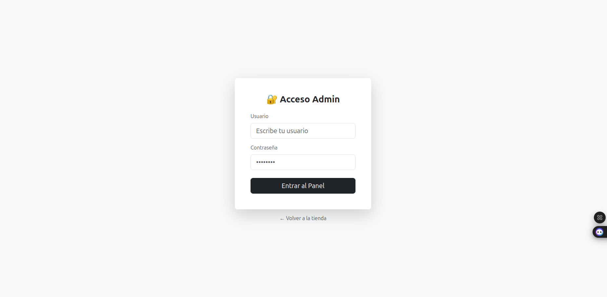
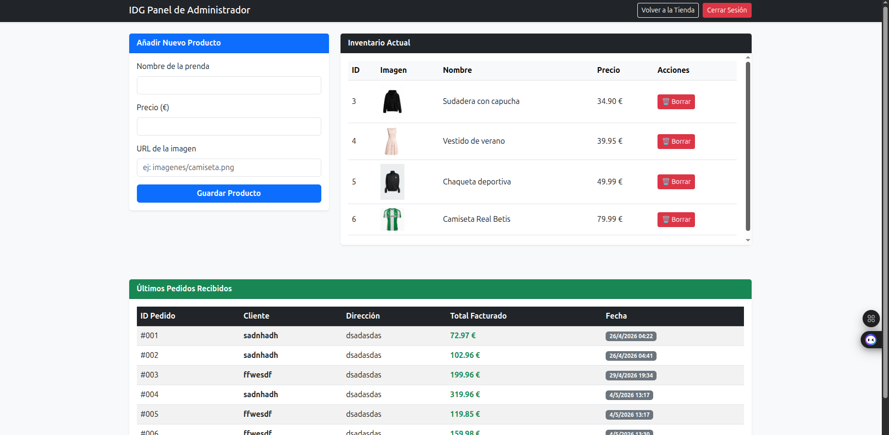

# 🎓 Proyecto Final: Plataforma E-commerce "Marca Ropa IDG"

## 1. Descripción del proyecto
Este proyecto es el desarrollo de una tienda online Full-Stack funcional para la marca **IDG**. Se trata de una aplicación web con arquitectura desacoplada que permite la gestión de un catálogo de ropa en tiempo real, administración de carrito de compras, persistencia de pedidos en una base de datos relacional y un panel de control privado para la administración del negocio. El sistema está implementado al 100%.

## 2. Tecnologías utilizadas
* **Backend:** Java 21 (OpenJDK), Spring Boot 3.2.x, Spring Data JPA, Maven 3.9.x.
* **Base de Datos:** MySQL 8.0.x (vía XAMPP).
* **Frontend:** HTML5, CSS3, JavaScript (ES6+), Bootstrap 5.3.x, SweetAlert2 (Notificaciones).
* **Entorno:** IntelliJ IDEA 2023.x / VS Code, Git/GitHub.

## 3. Requisitos previos
Para ejecutar el proyecto es necesario tener instalado:
* **JDK 21** o superior.
* **XAMPP** (con módulos Apache y MySQL).
* **Navegador web** actualizado (Chrome/Firefox).
* **VS Code** con la extensión **Live Server**.

## 4. Instrucciones de instalación paso a paso
1. **Clonación:** `git clone https://github.com/Ismael-dg/tu-repositorio.git`
2. **Base de Datos:**
    - Abrir XAMPP e iniciar MySQL.
    - Acceder a `http://localhost/phpmyadmin`.
    - Crear una base de datos llamada `Marca_Ropa_IDG`.
    - Importar el archivo `database/tienda.sql` (Asegurarse de que la tabla de pedidos cuenta con la columna `fecha_pedido` configurada en `CURRENT_TIMESTAMP`).
3. **Backend:** Abrir la carpeta `/backend` en IntelliJ IDEA y dejar que Maven descargue las dependencias (archivo `pom.xml`).
4. **Frontend:** Abrir la carpeta `/frontend` en VS Code.

## 5. Instrucciones de ejecución
1. **Iniciar Servidor (Backend):** Ejecutar la clase `TiendaRopaApplication.java` desde IntelliJ. El servidor arrancará por defecto en el puerto 8080.
2. **Iniciar Web (Frontend):** Abrir `index.html` con **Live Server**.
3. **Acceder al Panel Admin:** Navegar a `login.html` (Credenciales por defecto: Usuario `admin` | Contraseña `1234`).

## 6. Configuración necesaria
* **Puertos:**
    - Backend: `8080`
    - Frontend: `5500` (puerto por defecto de Live Server).
* **Variables de entorno:** Configurado en `src/main/resources/application.properties` para conectar con el puerto `3306` de MySQL.
* **Credenciales de prueba:**
    - Base de Datos: Usuario `root` | Contraseña: `` (vacío).

## 7. Funcionalidades implementadas (Front y Back)
* ✅ **Catálogo dinámico:** Carga de productos desde MySQL con imágenes y precios.
* ✅ **Buscador interactivo:** Filtrado de productos en el Frontend sin recarga de página mediante JS.
* ✅ **Gestión de Carrito:** Añadir, restar unidades y eliminar productos con recálculo de precios en tiempo real.
* ✅ **Sistema de Checkout:** Formulario modal para recoger datos de envío y pago.
* ✅ **Persistencia de Pedidos:** Guardado real de las compras en MySQL con fecha y hora exacta de la transacción.
* ✅ **Panel de Administración (Backoffice):** Interfaz para visualizar el inventario y auditoría de ventas.
* ✅ **Operaciones CRUD:** Creación y eliminación de productos desde la web de administrador con borrado en cascada.
* ✅ **Seguridad del Panel:** Sistema de login mediante validación JS y `sessionStorage`.
* ✅ **UI/UX Avanzada:** Integración de SweetAlert2 para modales interactivos y confirmaciones de acciones.

## 8. Funcionalidades para futuras versiones (Escalabilidad)
* 🚀 **Sistema de Usuarios (Clientes):** Login y Registro para que los clientes guarden su historial.
* 🚀 **Pasarela de Pago:** Integración con APIs de pago reales (Stripe/PayPal).
* 🚀 **Gestión de Stock:** Descuento automático de unidades del inventario tras finalizar una compra.

## 9. Problemas conocidos (Bugs menores)
* 🐛 **Responsive:** En resoluciones extremadamente bajas (inferiores a 320px), los botones del carrito pueden solaparse ligeramente.
* 🐛 **Caché:** En ocasiones es necesario realizar un refresco forzado (`Ctrl+F5`) para visualizar cambios en los estilos CSS tras una actualización en desarrollo.

## 10. Capturas de pantalla
**1. Catálogo General y Buscador:**

**2. Gestión de Carrito:**

**3. Formulario de Pago (Checkout):**

**4. Panel de Login del Administrador:**

**5. Backoffice (Gestión de Inventario y Ventas):**

## 11. Autor y contacto
* **Nombre:** Ismael Delgado García
* **Curso:** 2º DAM (Desarrollo de Aplicaciones Multiplataforma)
* **Correo:** ismael.dg2005@gmail.com
* **GitHub:** https://github.com/Ismael-dg