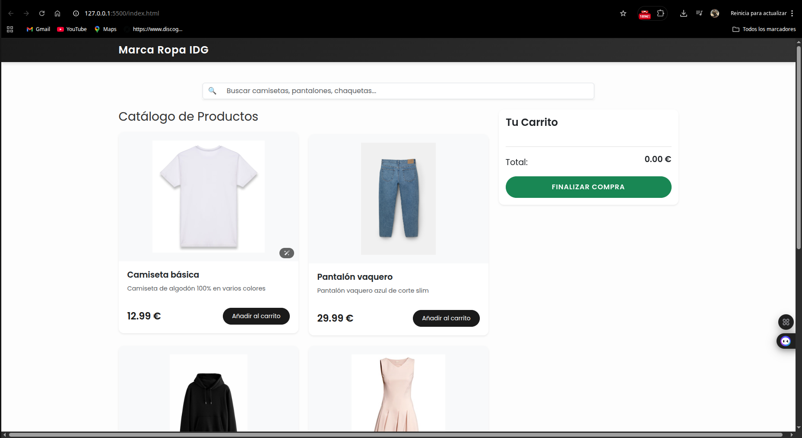
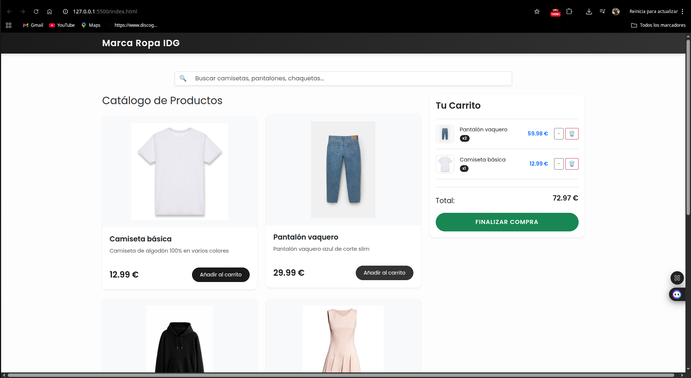
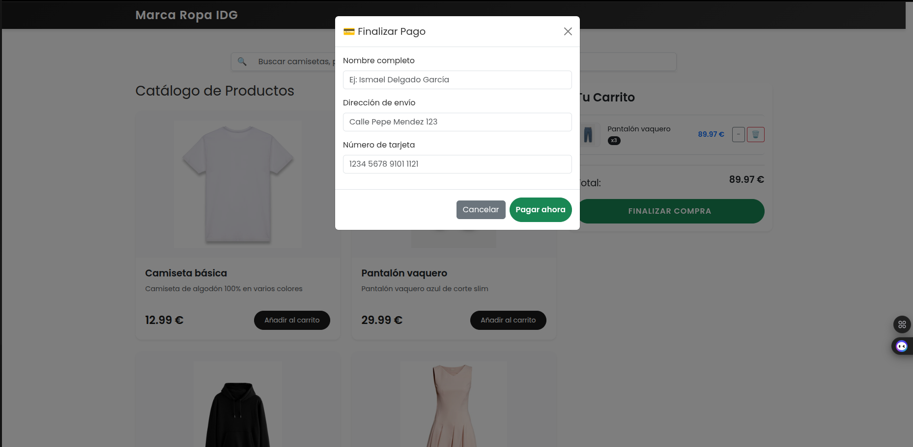
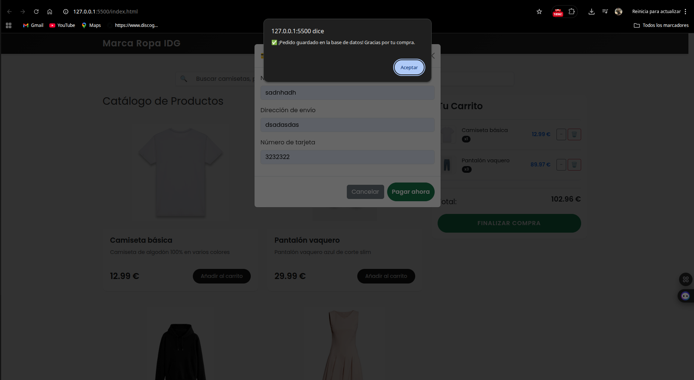

# 🛒 Marca Ropa IDG - Sistema Casi Completo (Hito A9)

## 1. Descripción del proyecto
Este proyecto es el desarrollo de una tienda online funcional para la marca **IDG**. Se trata de una aplicación web con arquitectura desacoplada que permite la gestión de un catálogo de ropa en tiempo real, administración de carrito de compras y persistencia de pedidos en una base de datos relacional. El sistema está implementado al 80%, cumpliendo con los requisitos core de negocio.

## 2. Tecnologías utilizadas
* **Backend:** Java 21 (OpenJDK), Spring Boot 3.2.x, Spring Data JPA, Maven 3.9.x.
* **Base de Datos:** MySQL 8.0.x (vía XAMPP).
* **Frontend:** HTML5, CSS3, JavaScript (ES6+), Bootstrap 5.3.x.
* **Entorno:** IntelliJ IDEA 2023.x / VS Code, Git/GitHub.

## 3. Requisitos previos
Para ejecutar el proyecto es necesario tener instalado:
* **JDK 21** o superior.
* **XAMPP** (con módulos Apache y MySQL).
* **Navegador web** actualizado (Chrome/Firefox).
* **VS Code** con la extensión **Live Server**.

## 4. Instrucciones de instalación paso a paso
1. **Clonación:** `git clone https://github.com/tu-usuario/tu-repositorio.git`
2. **Base de Datos:** - Abrir XAMPP e iniciar MySQL.
   - Acceder a `http://localhost/phpmyadmin`.
   - Crear una base de datos llamada `Marca_Ropa_IDG`.
   - Importar el archivo `database/tienda.sql`.
3. **Backend:** Abrir la carpeta `/backend` en IntelliJ IDEA y dejar que Maven descargue las dependencias (archivo `pom.xml`).
4. **Frontend:** Abrir la carpeta `/frontend` en VS Code.

## 5. Instrucciones de ejecución
1. **Iniciar Servidor (Backend):** Ejecutar la clase `TiendaRopaApplication.java` desde IntelliJ. El servidor arrancará por defecto en el puerto 8080.
2. **Iniciar Web (Frontend):** Abrir `index.html` con **Live Server**.

## 6. Configuración necesaria
* **Puertos:** - Backend: `8080`
   - Frontend: `5500` (puerto por defecto de Live Server).
* **Variables de entorno:** Configurado en `src/main/resources/application.properties` para conectar con el puerto `3306` de MySQL.
* **Credenciales de prueba:**
   - Base de Datos: Usuario `root` | Contraseña: `` (vacío).

## 7. Funcionalidades implementadas
* ✅ **Catálogo dinámico:** Carga de productos desde MySQL con imágenes y precios.
* ✅ **Buscador interactivo:** Filtrado de productos en el Frontend sin recarga de página mediante JS.
* ✅ **Gestión de Carrito:** Añadir, restar unidades y eliminar productos con recalculo de precios en tiempo real.
* ✅ **Sistema de Checkout:** Formulario modal para recoger datos de envío y pago.
* ✅ **Historial de Pedidos:** Persistencia real de las compras en la tabla `pedidos` de MySQL al finalizar la transacción.
* ✅ **Arquitectura REST:** Comunicación asíncrona mediante `fetch()` y JSON.

## 8. Funcionalidades pendientes (Para el 100%)
* ⏳ **Panel de Administración (Backoffice):** Interfaz para CRUD de productos desde la web.
* ⏳ **Sistema de Usuarios:** Login y Registro con sesiones/JWT.
* ⏳ **Gestión de Stock:** Descuento de unidades del inventario tras la compra.

## 9. Problemas conocidos (Bugs menores)
* ⚠️ **Responsive:** En resoluciones inferiores a 320px, los botones del carrito pueden solaparse ligeramente.
* ⚠️ **Caché:** En ocasiones es necesario realizar un refresco forzado (`Ctrl+F5`) para visualizar cambios en los estilos CSS tras una actualización.

## 10. Capturas de pantalla
**1. Catálogo General y Buscador:**

**2. Gestión de Carrito:**

**3. Formulario de Pago (Checkout):**

**4. Confirmación de Pedido con Éxito:**

**5. Persistencia en Base de Datos (phpMyAdmin):**

## 11. Autor y contacto
* **Nombre:** Ismael Delgado García
* **Curso:** 2º DAM
* **Correo:** ismael.dg2005@gmail.com
* **GitHub:** https://Ismael-dg@github.com