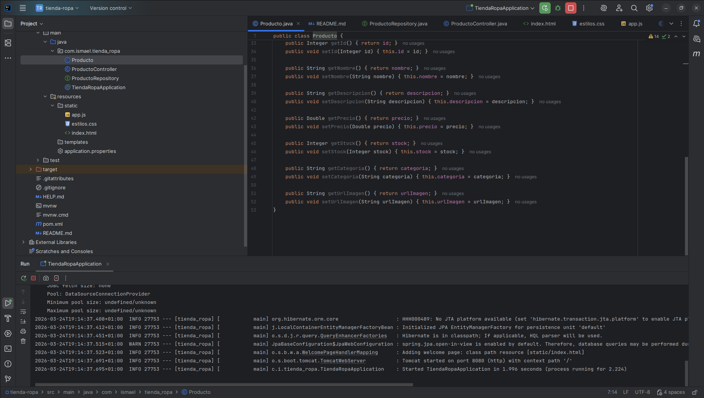
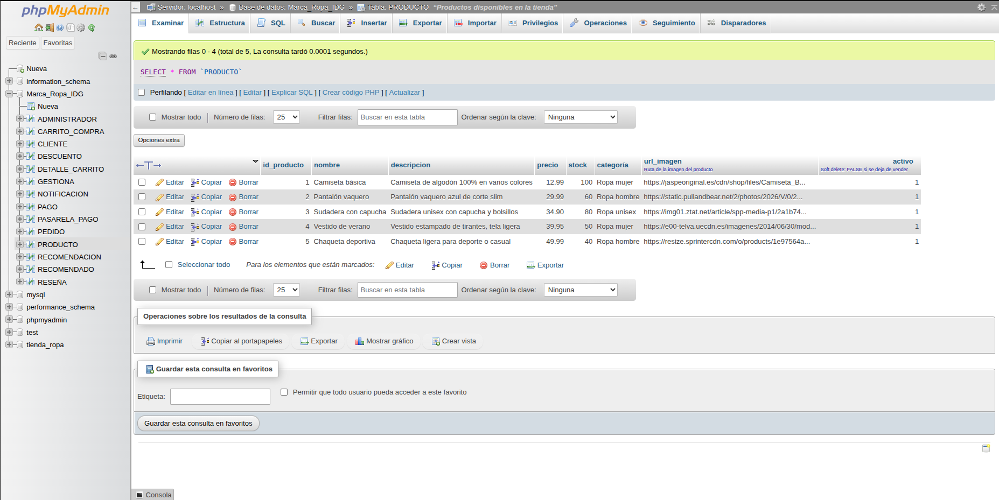
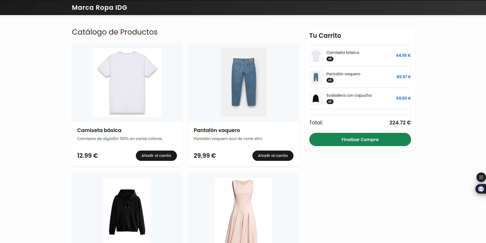

# 1. 👕 Marca Ropa IDG - Prototipo Funcional (A8)

## 2. Descripción breve
Este proyecto es el Prototipo Funcional Medio para la tienda online **Marca Ropa IDG**. Consiste en un catálogo web interactivo con arquitectura desacoplada (Frontend y Backend separados), que consume datos en tiempo real desde una base de datos relacional mediante una API REST.

## 3. Tecnologías utilizadas
* **Backend:** Java 21, Spring Boot (Spring Web, Spring Data JPA), Maven.
* **Base de Datos:** MySQL.
* **Frontend:** HTML5, CSS, JavaScript, Bootstrap 5.
* **Herramientas/IDE:** IntelliJ IDEA, Visual Studio Code, XAMPP (phpMyAdmin).

## 4. Requisitos previos
Para poder ejecutar este proyecto en tu entorno local, necesitas tener instalado:
* **Java Development Kit (JDK):** Versión 17 o superior (Recomendado JDK 21).
* **XAMPP:** Para los servicios de servidor Apache y base de datos MySQL.
* **Visual Studio Code:** Con la extensión **Live Server** instalada.
* **IntelliJ IDEA** (o Eclipse): Para ejecutar el backend.

## 5. Instrucciones de instalación
1. **Clonar el repositorio:** Descarga o clona este proyecto en tu ordenador.
2. **Configurar la Base de Datos:**
    * Abre XAMPP e inicia los módulos de **Apache** y **MySQL**.
    * Ve a `http://localhost/phpmyadmin`.
    * Importa el archivo `tienda.sql` ubicado en la carpeta `/database/`. Esto creará la base de datos `Marca_Ropa_IDG` automáticamente.
3. **Instalar dependencias del Backend:**
    * Abre la carpeta `/backend` del proyecto con IntelliJ IDEA.
    * Maven detectará automáticamente el archivo `pom.xml` y descargará todas las librerías necesarias de Spring Boot.

## 6. Instrucciones de ejecución
Para que el proyecto funcione, debes levantar ambos entornos (Backend y Frontend):

**Paso 1: Arrancar el Servidor (Backend)**
1. En IntelliJ IDEA, navega hasta `src/main/java/.../TiendaRopaApplication.java`.
2. Ejecuta la clase (Run). El servidor de datos se iniciará en `http://localhost:8080`.

**Paso 2: Arrancar la Web (Frontend)**
1. Abre la carpeta `/frontend` en Visual Studio Code.
2. Haz clic derecho sobre el archivo `index.html` y selecciona **"Open with Live Server"**.
3. El navegador se abrirá automáticamente (normalmente en el puerto `5500`) mostrando la tienda conectada a la base de datos.

## 7. Funcionalidades implementadas
* ⚙️ **Arquitectura desacoplada:** Separación total entre cliente (JS) y servidor (Java).
* 🖼️ **Catálogo dinámico:** Carga de productos (imágenes, precios, títulos) directamente desde MySQL.
* 🔐 **CORS configurado:** API preparada para recibir peticiones seguras desde el frontend.
* 🔍 **Buscador en tiempo real:** Filtrado dinámico de productos en el catálogo mediante JS sin recargar la página.
* 🛍️ **Gestión avanzada del carrito:** Funcionalidad para agregar productos, modificar cantidades (sumar y restar) y eliminar artículos, actualizando el total al instante.
* 💳 **Sistema de Pago (Checkout):** Ventana emergente (modal) para simular la confirmación del pedido, procesar datos de envío y vaciar el carrito tras el pago.

## 8. Funcionalidades pendientes (A9)
* 📦 **Historial de pedidos:** Vincular los carritos finalizados con la base de datos de MySQL.
* 👤 **Sistema de Usuarios:** Registro y login de clientes.
* 🛠️ **Panel de Administrador (Backoffice):** Interfaz para añadir, editar o borrar productos de la base de datos sin usar phpMyAdmin.

## 9. Autor
* **Nombre:** Ismael Delgado García
* **Curso:** 2º DAM

---

### 📸 Anexos: Vistas del Proyecto

**Estructura del Proyecto en IntelliJ:**

**Base de Datos en phpMyAdmin:**

**Vista del Navegador:**
